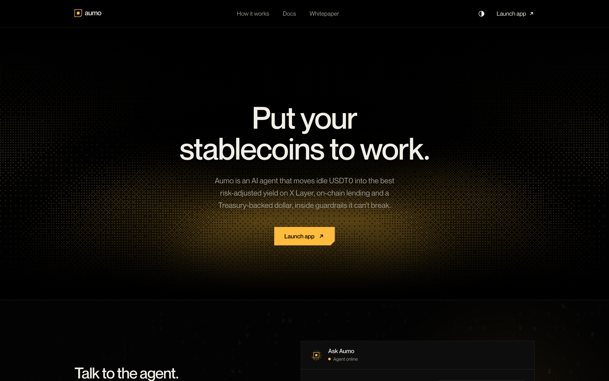
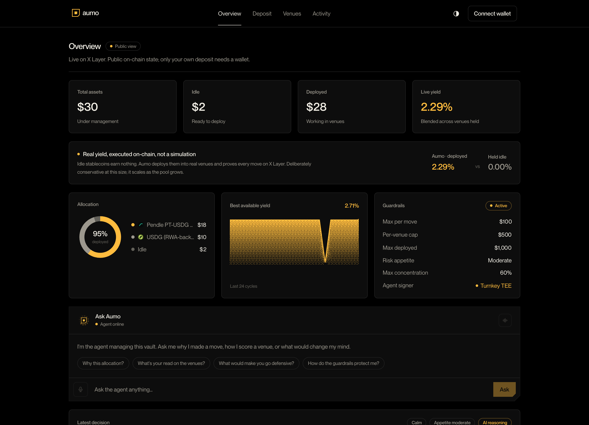
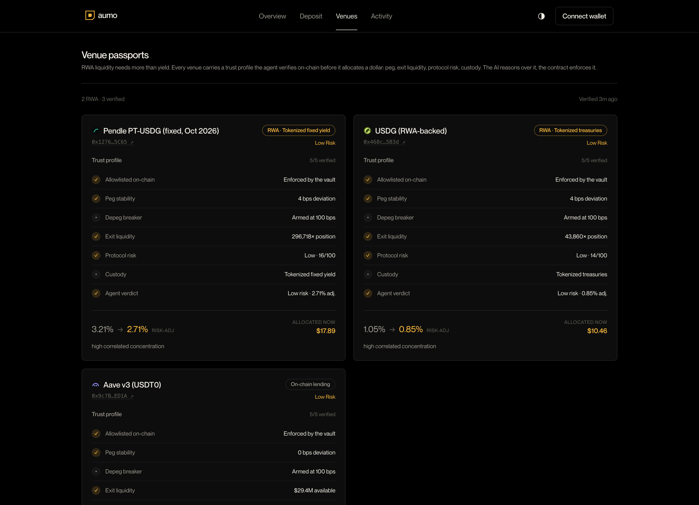
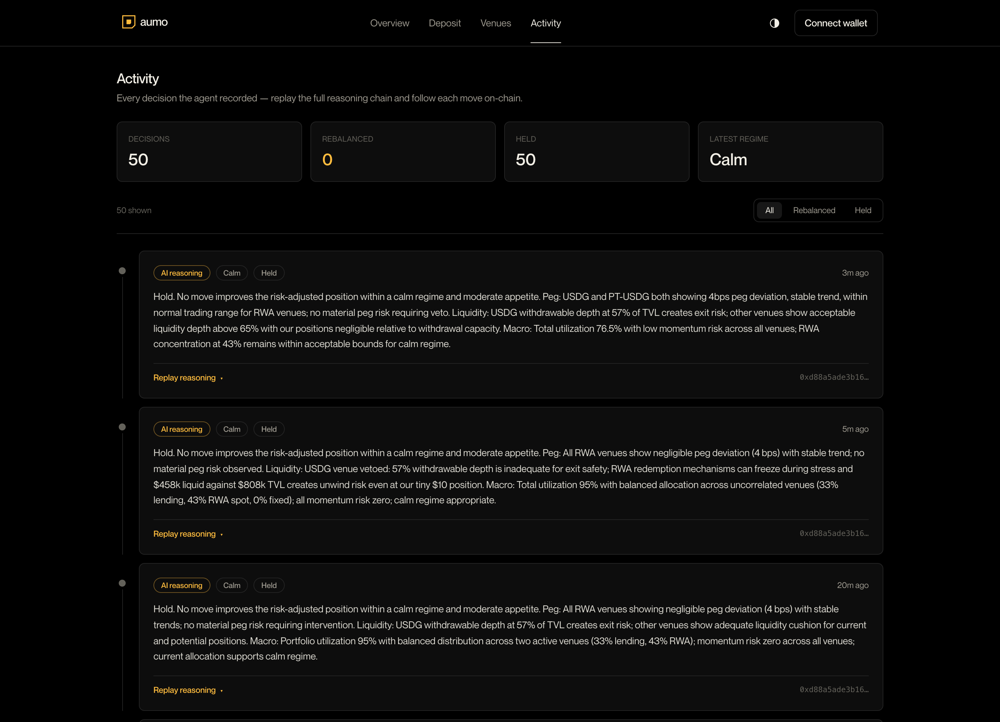

<div align="center">



# Aumo

**An autonomous AI agent you can hand stablecoins to.**

Deposit USDT0. Aumo moves it into the best risk-adjusted real-world-asset yield on X Layer,
rebalances on its own inside guardrails it cannot break, and proves every move on-chain.

_Give a stablecoin a job._

[aumo.finance](https://aumo.finance) · [app.aumo.finance](https://app.aumo.finance) · [@aumofinance](https://x.com/aumofinance)

Live on X Layer (chainId 196) · AumoPool `0x8a98A4A868e5FBAc05B9d1dC0742BD008354114F`

</div>

---

## The idea

Idle stablecoins earn nothing, and managing them across on-chain RWA venues is constant manual
work: compare yields, weigh peg and liquidity risk, move funds, watch for changes, repeat. Aumo is
an agent that does that for you, inside limits you set on-chain, and leaves a verifiable receipt for
every action. The agent reasons. The contract enforces. You can check both.

## Live dashboard

Every number below is read straight from the chain. The public view needs no wallet; only your own
deposit does.

<div align="center">

</div>

Total assets under management, what is idle versus deployed, blended live yield, the current
allocation, and the exact guardrails in force. Real yield, executed on-chain, not a simulation.

## How it works

1. **Deposit** — fund the vault with USDT0 and set a risk band.
2. **Sense** — the agent reads live vault state and market data across every allowlisted venue.
3. **Score** — a risk engine haircuts each venue's yield by protocol, liquidity, peg, utilization, and concentration risk, then ranks on risk-adjusted yield, not headline APY.
4. **Reason** — an LLM layer reads the market regime and can only make the plan more conservative. It can never loosen a guardrail, add a venue, or move funds itself.
5. **Act and prove** — it rebalances through the vault within your caps, emits an on-chain receipt per move, and records the full reasoning trail bound to a fingerprint of the exact policy that governed it.

## Venue passports

RWA liquidity needs more than a yield number. Every venue carries a trust profile the agent
verifies on-chain before it allocates a dollar: allowlist status, peg deviation, exit liquidity
against position size, protocol risk, custody model, and a depeg breaker armed on-chain. The agent
reasons over the profile; the vault enforces the allowlist.

<div align="center">

</div>

## Trust model

Aumo moves real funds, so control lives in the contract, not the agent. The agent can only ever act
inside limits the owner sets on-chain:

- Allowlisted venues only, never an arbitrary address.
- Per-move, per-venue, and total-deployed caps.
- A rolling per-epoch loss budget and a per-epoch deploy budget, so a compromised or mispriced agent can churn only until the budget is spent, not until the treasury is empty. Both the entry swap and the exit round trip are metered through it.
- Owner-set risk band, pause, and kill-switch.

The agent can never exceed policy, touch a non-allowlisted venue, or withdraw to an arbitrary
address. Remove the agent and the funds are still safe.

Two more properties make it auditable: every move carries a plain-language rationale, and every
decision is stamped with a fingerprint of the exact guardrails in force, so the reasoning trail can
be checked against the policy that governed it.

## Proof, not promises

Every decision the agent ever made is recorded. Replay the full reasoning chain and follow each move
to its transaction on-chain.

<div align="center">

</div>

## Architecture

| Package      | What it is                                                                        |
| ------------ | --------------------------------------------------------------------------------- |
| `contracts/` | `AumoPool` (ERC-4626) plus venue adapters (Solidity / Foundry). The pool holds funds and enforces every policy; each adapter is fork-tested against its live venue on X Layer mainnet. |
| `agent/`     | The reasoning brain (TypeScript / viem): sense, risk engine, planner, tighten-only LLM layer, on-chain executor, and the receipt trail. |
| `web/`       | The dashboard (Next.js): positions, the agent's reasoning, venue passports, and receipts. |

### Venue adapters

| Adapter            | Venue                              | Yield source                    |
| ------------------ | ---------------------------------- | ------------------------------- |
| `AaveV3Adapter`    | Aave v3                            | On-chain lending                |
| `RwaUsdgAdapter`   | USDG                               | Tokenized Treasuries (RWA)      |
| `PendlePtAdapter`  | Pendle PT-USDG                     | Tokenized fixed yield (RWA)     |
| `UniV3LpAdapter`   | USDG/USDT0 Uniswap v3 (full range) | RWA liquidity provision         |

Every adapter is verified end to end on a fork of live X Layer mainnet (chainId 196): deposit,
value, and full exit round-trip against the real venue. Three are live on the mainnet pool today;
the USDG/USDT0 LP adapter is the newest and is pending allowlisting on the live pool.

```bash
cd contracts
forge build
forge test                                          # offline unit tests + invariants
RUN_FORK=1 XLAYER_MAINNET_RPC=<rpc> forge test --match-path 'test/fork/*'
```

## Quickstart

```bash
# agent
cd agent
npm install
cp .env.example .env      # RPC_URL, VAULT_ADDRESS, AGENT_PRIVATE_KEY (testnet throwaway)
npm run identity          # the agent's identity card
npm run plan              # sense, score, reason — never sends a transaction
npm test                  # risk engine, planner caps, and the tighten-only safety kernel
```

Deploy the pool and adapters to X Layer mainnet (config in `contracts/.env.example`, real capital):

```bash
forge script script/DeployPoolMainnet.s.sol \
  --rpc-url $XLAYER_MAINNET_RPC --private-key $PRIVATE_KEY --broadcast
```

## Security

Funds are guarded by the contract, not the agent. Secrets never live in the repo. Testnet before
mainnet, fork tests before deploy, review before shipping money-code. See [SECURITY.md](SECURITY.md).

## Built with

Solidity · Foundry · TypeScript · viem · Next.js · X Layer · USDT0 · Aave · USDG · Pendle · Uniswap v3 · Turnkey TEE

## License

MIT — see [LICENSE](LICENSE).
